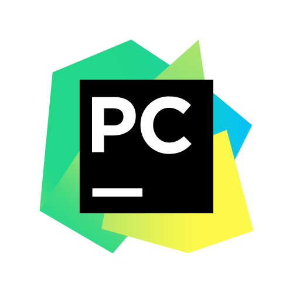

### Hi there Im Alexey Kiselev - aka Sangrem 

- 🔭 I’m looking for my first Developer work.
- 🌱 I’m currently learning C#, Python, and neural network technology.
- 👯 I’m looking to collaborate with anyone!
- 🤔 I’m currently working on some games, and little projects. 

### Languages and Tools

          

### Statistics

